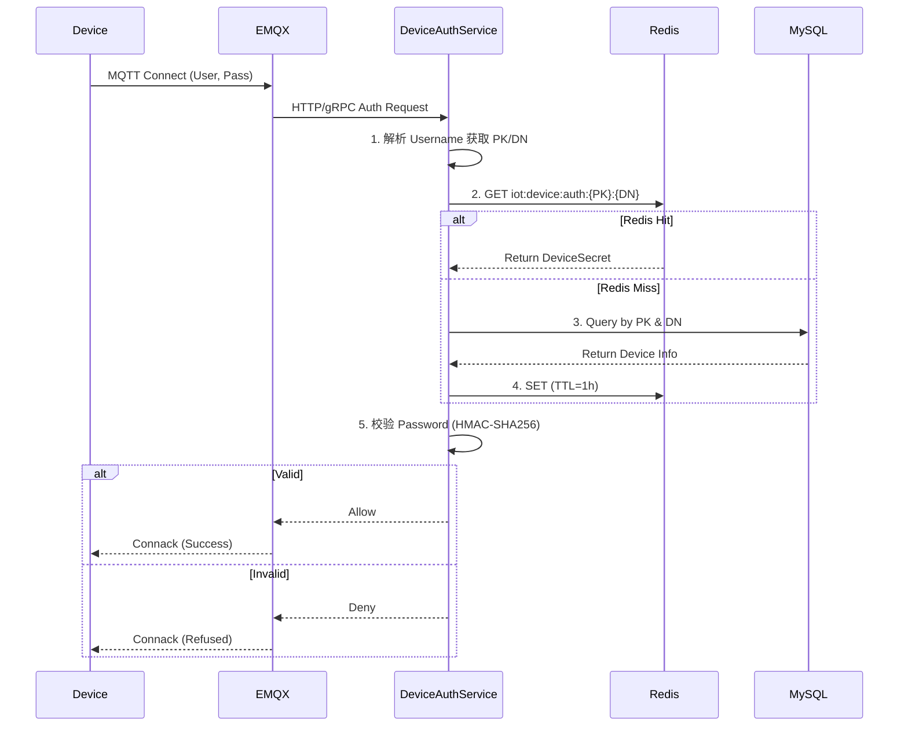

# IOT 模块开发者上手指南 (Go 版)

本指南旨在帮助您快速熟悉 IOT 系统的架构设计、代码组织及核心业务流程，使您能够直接参与开发。

---

## 1. 核心设计哲学
系统采用 **EDA (事件驱动架构)**。
*   **解耦**：网关层（负责物理连接）与业务层（负责数据处理）通过内部 `MessageBus` 完全解耦。
*   **协议无关**：通过 `Codec` 抽象支持多种协议（默认 Alink），新协议只需实现接口即可。
*   **异步化**：数据入库、告警检测、日志记录等耗时操作均通过协程或消息队列异步处理。

---

## 2. 目录职责地图

| 目录路径 | 核心职责 | 关键文件 |
| :--- | :--- | :--- |
| `internal/iot/core` | **核心抽象与算法** | `message_bus.go` (总线), `device_auth.go` (HMAC 算法) |
| `internal/iot/gateway` | **物理接入层** | `mqtt_client.go` (连接 EMQX), `codec/` (协议解析), `connection_manager.go` (状态) |
| `internal/service/iot` | **业务逻辑层** | `device_message_service.go` (处理中心), `ota_task_service.go` (升级控制) |
| `internal/api/handler/admin/iot` | **后台管理接口** | 设备、产品、OTA 的 CRUD |

---

## 3. 核心业务流：从设备上报到告警 (上手实战)

假设您要测试一个“温度超标告警”场景：

### 第一步：设备上行 (MQTT -> Gateway)
设备向主题 `/sys/{PK}/{DN}/thing/event/property/post` 发送：
```json
{"method": "thing.event.property.post", "params": {"temp": 55}}
```
*   **代码锚点**：`internal/iot/gateway/mqtt_client.go` 的 `onMessage` 接收并调用 `AlinkCodec` 解码。
*   **流转**：解码后的 `IotDeviceMessage` 被 `Post` 到 `MessageBus`。

### 第二步：业务分发 (Bus -> Service)
*   **代码锚点**：`internal/iot/gateway/device_message_subscriber.go` 监听总线，识别出是属性上报，调用 `DeviceMessageService`。
*   **存储**：`device_message_service.go` 的 `handlePropertyPost` 将数据分发。

### 第三步：告警评估 (Service -> Alert)
*   **逻辑**：系统查询该产品的 `AlertConfig`。如果存在“temp > 50”的规则，则触发。
*   **持久化**：`AlertRecordService` 创建告警单。

---

## 4. 如何扩展系统

### A. 增加一种通讯协议 (例如物联云协议)
1. 在 `internal/iot/gateway/codec/` 下实现 `Codec` 接口（`Encode`/`Decode`）。
2. 在 `codec/registry.go` 中注册新协议。
3. 产品模型中指定该 `CodecType`。

### B. 修改指令下发逻辑 (Cloud -> Device)
1. 观察 `internal/service/iot/device_message_service.go` 的 `SendDeviceMessage`。
2. 它会通过 `MessageBus` 发布主题为 `iot_gateway_downstream_{ServerID}` 的消息。
3. 若需修改下发格式，请调整 `internal/iot/gateway/downstream_subscriber.go`。

---

## 5. 开发环境与工具指引

1.  **依赖注入**：项目使用 `Wire`。
    - **修改 Service 构造函数后**，必须运行：`cd cmd/server && wire`。
2.  **配置中心**：
    - IOT MQTT 地址在 `config/config.local.yaml` (或对应环境配置) 的 `mqtt` 节点。
    - 数据库/Redis 配置同步于系统全局配置。
3.  **常用命令**：
    ```bash
    # 重新生成依赖注入
    cd cmd/server && wire
    
    # 运行测试
    go test ./internal/service/iot/...
    ```

---

## 6. 避坑指南 (Tips)
*   > [!IMPORTANT]
    > **循环依赖**：切勿在 `core` 包中引用 `service`。业务实现应通过构造函数注入到网关层。

---

## 7. 专题深度解析：设备认证机制

设备连接 EMQX 不仅需要 TCP 握手，还必须通过严格的身份验证。本系统采用阿里云 IOT 标准的签名算法。

### A. MQTT 连接三要素
设备端 MQTT 客户端连接时，需按以下规则构造参数：

*   **ClientID**: `{productKey}&{deviceName}` (注意：中间是 `&` 符号)
*   **Username**: `{productKey}&{deviceName}`
*   **Password**: 对特定字符串进行 HMAC-SHA256 签名后的 Hex 字符串

### B. 密码生成算法 (HMAC-SHA256)
密码计算公式：`hmac_sha256(deviceSecret, content)`

1.  **Content 拼接规则**：
    ```text
    deviceName{deviceName}productKey{productKey}
    ```
    *   示例：若 PK="a123", DN="d001"，则 Content="deviceNamed001productKeya123"

2.  **Go 实现参考** (`internal/iot/core/device_auth.go`)：
    ```go
    func BuildPassword(deviceSecret, content string) string {
        h := hmac.New(sha256.New, []byte(deviceSecret))
        h.Write([]byte(content))
        return hex.EncodeToString(h.Sum(nil))
    }
    ```

### C. 服务端认证流程 (Redis + DB)
为了支撑高并发连接，服务端实现了多级缓存认证策略。



### D. 缓存策略
*   **Key 格式**: `iot:device:auth:{productKey}:{deviceName}`
*   **有效期**: 1 小时 (TTL)
*   **一致性**: 设备信息修改（如重置密钥）时，需同步失效缓存（todo）。
