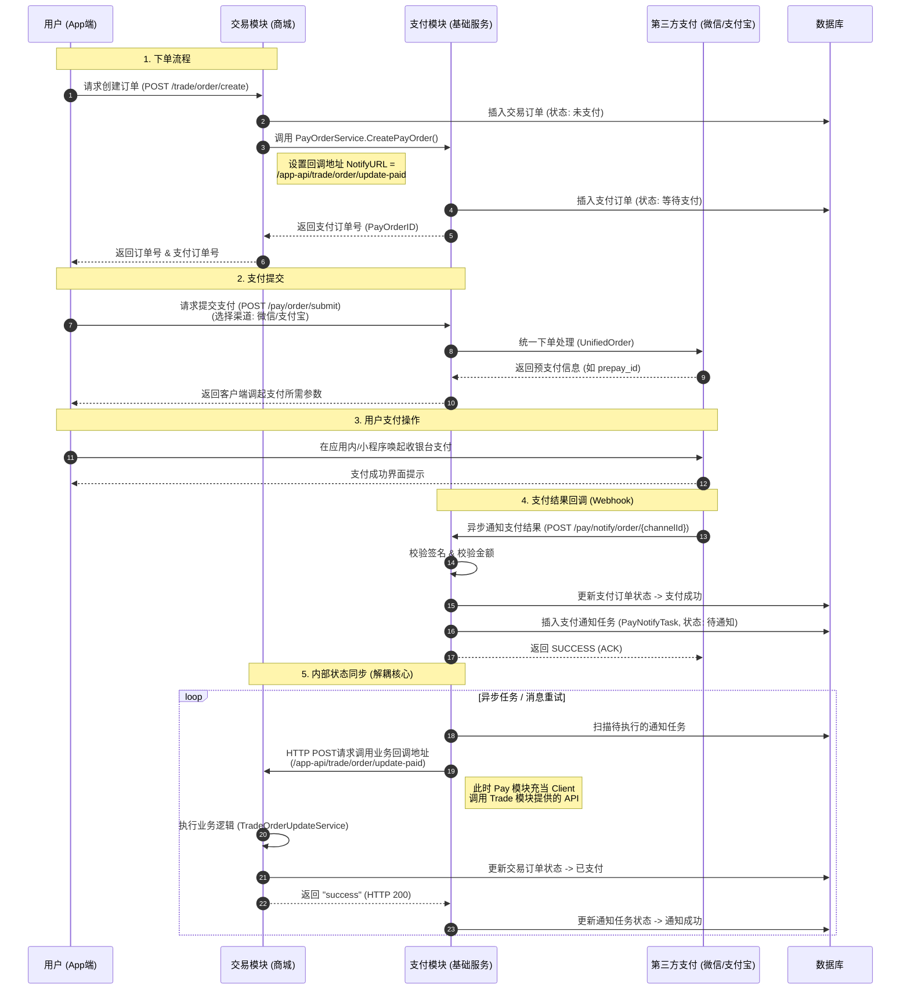

# 订单支付全生命周期流转图 (Order Payment Lifecycle)

本图展示了从用户下单到支付完成及状态同步的完整流程。

## 关键说明
1.  **物理隔离**: `Trade` (交易) 模块和 `Pay` (支付) 模块在代码逻辑上是完全解耦的。`Pay` 模块通过 HTTP 回调（步骤 5）通知 `Trade` 模块，而不是直接去操作交易模块的数据库表。
2.  **可靠性保证**: 如果步骤 5 中的 HTTP 回调因为网络或业务系统繁忙而失败，`PayNotifyTask` 会在数据库中保持“待通知”状态，并按照指数退避策略（如 15s, 30s, 3m...）自动重试，确保交易状态最终一定会被同步。
3.  **核心接口映射**:
    - **下单**: `TradeOrderUpdateService.CreateOrder`
    - **提交支付**: `PayOrderService.SubmitOrder`
    - **支付回调处理**: `PayOrderService.NotifyOrder`
    - **业务状态更新**: `AppTradeOrderHandler.UpdateOrderPaid`
