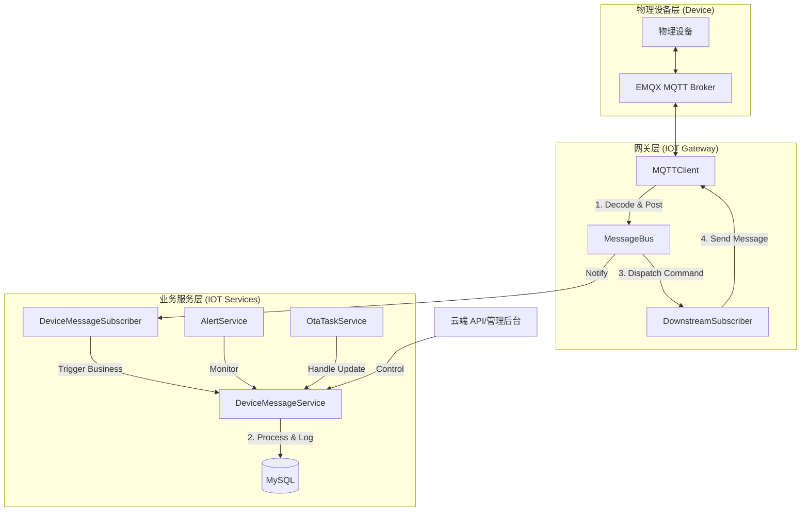

# IOT 架构与数据流转全景图

为了帮助您深入理解当前 IOT 模块的功能实现，我整理了以下核心数据流转流程。

## 1. 核心架构全视图

当前系统基于**事件驱动架构 (EDA)**，通过内部消息总线 (`MessageBus`) 解耦网关层与业务层。

---

## 2. 关键流程解读

### A. 设备数据上报 (Upstream)
1. **接入**：物理设备通过 MQTT 协议将 Alink 报文发送至 EMQX。
2. **解码**：`MQTTClient` 接收报文，调用 `AlinkCodec` 解码为统一的 `IotDeviceMessage` 结构。
3. **分发**：解码后的消息发布到 `MessageBus` 的 `core.DeviceMessageTopic` 主题。
4. **处理**：`DeviceMessageSubscriber` 消费该消息并分发给业务服务：
   - **属性上报**：调用 `handlePropertyPost` 解析数据并持久化到属性日志库。
   - **状态更新**：如收到上线/离线事件，同步更新 `IotDeviceDO` 的 `state` 字段。
   - **异步日志**：`DeviceMessageService` 会将原始上报记录异步入库，便于后续审计。

### B. 云端控制指令 (Downstream)
1. **发起**：用户通过管理后台调用 API（如发送命令）。
2. **构建**：`DeviceMessageService` 构建下行指令，并发布到 `iot_gateway_downstream_{ServerID}` 主台。
3. **转发**：网关层的 `DownstreamSubscriber` 监听到指令。
4. **下发**：调用 `MQTTClient.SendDownstreamMessage`，经过编码后通过 MQTT 推送到物理设备。

### C. 告警触发机制
*   **实时检测**：在 `DeviceMessageService` 处理属性上报时（或通过独立的告警订阅者），系统会根据 `AlertConfig` 中的规则（如：温度 > 50度）进行匹配。
*   **记录与通知**：匹配成功后，`AlertRecordService` 创建告警记录，并根据配置触发邮件/短信通知。

### D. OTA 升级闭环
1. **任务下发**：云端创建 OTA 任务，通过下行链路推送 `thing.service.ota.push` 指令给设备。
2. **进度上报**：设备在下载和安装过程中，不断上报 `thing.ota.progress`。
3. **状态追溯**：`OtaTaskService` 接收进度上报，更新 `OtaTaskRecord` 的完成百分比。
4. **最终闭环**：当收到 `success` 状态时，系统自动调用 `DeviceService.UpdateDeviceFirmware` 更新设备的固件版本 ID，完成整个升级周期。

---

## 3. 核心对象关系

| 组件 | 职责 |
| :--- | :--- |
| **MessageBus** | 系统心脏，负责网关与业务的完全解耦。 |
| **CodecRegistry** | 翻译官，支持多协议转换（目前主推 Alink）。 |
| **DeviceMessageService** | 业务大脑，处理所有上行报文的解析、鉴权与异步日志。 |
| **ConnectionManager** | 状态管家，维护设备的长连接状态与心跳。 |
